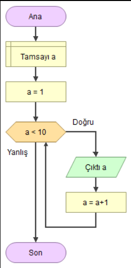

# Java101 Konu Anlatımı

- .java uzantılı java kaynak kodlarının ismi .java uzantılı dosyada public class ismi ile aynı olmak zorundadır.
- .java uzantılı kaynak kod dosyasında sadece bir adet public class bulunabilir.
- Java derlenen ve yorumlanan bir dildir.Java kaynak kodları compile edilere byte code olarak .class uzantılı dosyalar
  oluşturulur ve .class uzantılı dosyalar JVM(Java Virtual Machine) tarafından yorumlanarak çalıştırılır.
- Java crossplatform bir programlama dilidir ve bu JVM sayesindedir.
- JDK (Jav Development Kit) içerisinde JRE(Java Runtime Environment) , Compiler , Debugger ve JavDoc vardır.JRE
  içerisinde de JVM(Java Virtual Machine) ve Class Libraries vardır. Compile edilen .java uzantılı kaynak kod dosyaları
  byte code olarak .class uzantılı dosyalara çevrilir ve .class uzantılı dosyalar JVM üzerinde yorumlanarak
  çalıştırılır.

  

## Program Nedir ?

- Sözlükte program kelimesi, belirli şartlara ve düzene göre yapılması öngörülen işlemlerin bütünü ve aynı zamanda
  izlence olarak tanımlanmıştır. Yazılımcılara göre Program, bilgisayara bir işlemi yaptırmak için yazılan komutlar
  dizisidir.

## Programlama Nedir ?

- Programlama, “bilgisayara çeşitli görevleri yerine getirmesi için talimat vermenin” bir yoludur. Bu talimatlar,
  makinelerin nasıl çalışacağını veya çalıştıracağını söyleyebilir. Programlama bilgisayar ne yapması gerektiğini
  söyleyen, problemlere çözümler üreten ve bu çözümleri algoritmalar ile destekleyen bir öğretme işlemidir.

- Günümüzde bir çok özelliğe sahip, işlem güçleri yüksek bilgisayarlar veya donanımlar mevcut. Hatta süper bilgisayar
  olarak adlandırılan milyon dolarlar harcanan donanımlar bile kullanılıyor. Ama bu bilgisayarlara ne yapacağını
  söylemediğiniz sürece, dünyanın en vasıfsız cihazlarından bir farkları olmayacaktır. Bilgisayarları hayatımızda bu
  kadar önemli hale getirmek için programlama tanımı devreye girmektedir.

## Algoritma Nedir ?

- Algoritma belirli bir problemi çözmek veya belirli bir şartı sağlamak için tasarlanmış yoldur .Bilgisayar bilimlerinde
  ve Matematikte bir işi yapmak için oluşturulan, başlangıç ve bitiş noktası olan sonlu işlemler kümesidir. Bilgisayar
  bilimlerinin önemli bir parçası olup , programlamada kullanılır. Tüm programlama dillerinin temelleri algoritmaya
  dayanır.

- Bir bilgisayarları harekete geçirmek için, bilgisayara programları yazmak gerekmektedir. Bir program yazmak için,
  bilgisayar adım adım, tam olarak ne yapmak istediğini söylemek gerekir. Bilgisayar daha sonra bu adımları izleyerek
  istediğimiz eylemi gerçekleştirir.

- Bilgisayara ne yapacağınızı söylediğinizde, bunun nasıl yapılacağını da seçersiniz. İşte burada bilgisayar
  algoritmaları devreye giriyor. Algoritma işi yapmak için kullanılan temel tekniktir.

- Bilgisayar programlamada, verilen herhangi bir görevi yerine getirmenin birçok farklı yolu vardır. Her algoritmanın
  farklı durumlarda avantajları ve dezavantajları vardır. Bizler en uygun algoritmaları seçmeye çalışırız.

## Programlama Dili Nedir ?

- Dil, binlerce yıldır insanlar için iletişim aracı olmuştur. Bir topluluk için, dil insanların iletişim kurması gereken
  kelimeleri içeriyordur. Bilgisayarlara baktığımızda da , bu durumun çok farklı olmadığını göreceksiniz. Birbirleriyle
  iletişim kurması gereken bir çok donanım ve yazılım bileşenleri vardır.

- Eski bilgisayarlar aslında devre ve kabloların yerleriyle oynayarak bir ve sıfırların elle değiştirilmesiyle
  programlandı. Tabii ki, bu tür ilkel programlar için kullanılan yöntem zordu. Bu nedenle programlama dillerinin
  oluşturulması, bilgisayar bilimlerini başka bir seviyeye taşıyan devrim niteliğinde bir adımdı. Normal dillerden
  farklı olarak, programlama dillerindeki anahtar kelimeler sınırlıdır. Bu kelimeleri birleştirerek , programcılar
  farklı türlerde programlar oluşturabilirler. Yazılan kodları makinenin anladığı dile dönüştüren ara birimlerde
  mevcuttur.

- "Programlama Dili , insanların bilgisayarlarla etkileşime girdiği bir dizi talimattır."

## Sözdizimi (Syntax) Nedir ?

- Syntax (Sözdizimi ), yazılan herhangi bir sözün sırasıyla ilgilenen bilim dalıdır. Türkçede cümle ögelerinin
  diziliminin bir sırası söz konusuysa diğer programlama dillerinde de aynı şey söz konusudur. Programlama dillerinde de
  tıpkı bizim günlük hayatta kullandığımız dilde olduğu gibi belli dizilim kuralları vardır. Bu dizilim kuralları
  sayesinde her şey makineler ve insanlar tarafından daha rahat anlaşılabilir ve yorumlanabilir bir hal almaktadır.
  Bunların dışına çıkıldığında veya bir eksiklik yapıldığında o kod satırı tam olarak yorumlanamaz ve hatayla
  karşılaşılır. Buna da Syntax Error adı verilmektedir.

## Java Nedir ?

### Java Tarihçesi

- 1991 yılında Sun Microsystems şirketi mühendislerinden James Gosling ve 12 arkadaşı Green Project(Yeşil Proje) isimli
  bir proje geliştirmeye başladılar. Gömülü Sistemler üzerine çalışan James Gosling ve ekibi başlangıçta C ve C++
  dillerini kullansalar da bu dillerin geliştirdikleri projeye uygun bir dil olmadığını ve geliştirdikleri proje için
  yetersiz olduğunu görüp yeni bir arayış içine girdiler ve bu sırada “Oak” şimdiki adıyla Java dili doğmuş oldu.

- Java, doğrudan C++ ile bağlantılıdır. C++ ise C’nin devamıdır. Java, karakteristik özelliklerinin birçoğunu bu iki
  dilden almıştır. C’nin sözdizimi (syntax), C++’ın ise nesne yönelimli programlama (object oriented programming- OOP)
  kavramları Java’ya miras kalmıştır. Bunun yanı sıra, Java, bu dillerdeki karmaşıklığı ortadan kaldırmış, eksik
  özelliklerini ise tamamlamıştır.

### Java'nın Avantajları Nelerdir ?

#### Basit Olması

- Java’nın yazımı kolaydır. daha okunaklı bir yapısı vardır ve dikkat çekicidir. Java geleceğe dönük olarak
  oluşturulacak yapılarla kullanımı kolaylaştırılır, sadeleştirilir ve öğrenmesi kolaydır.

#### Tarafsız Mimariye Sahip

- Java özel makinelere ya da işletim sistemi mimarilerine bağlı değildir. Java donanımdan bağımsızdır. Java'yı platform
  bağımsız kılan özelliği yazılan kaynak kodlar derlendikten sonra ara bir dil olan byte code'a çevrilmesidir. Ara dile
  çevrilen bu kod parçaları Java Virtual Machine vasıtasıyla yorumlanır ve çalıştırılır. Buradaki tek sorun hız
  sorunudur. Çünkü işletim sistemiyle birlikte Virtual Machine’de bilgisayarın kaynaklarını kullandığı için daha yavaş
  çalışmaktadır.

#### Nesne Yönelimli Olması

- Java da C++ gibi nesne yönelimlinin özelliklerinden faydalanır. Sınıflar oluşturularak daha az kod yazıp daha fazla iş
  yaparak kod tekrarı önlenmiş olur. Böylece geliştirme sürecinin verimliliği artar.

#### Zengin Kütüphane Desteği

- Java çok zengin ve geniş bir kütüphaneye sahiptir ve ücretsiz olarak erişim sağlayıp temin edilebilir. Bu sayede bir
  çok platformda uygulama geliştirme imkanı sağlar.

#### Multi-Thread & Dinamik

- 'Multi-Thread' bir programda bir çok işlemin aynı zamanda gerçekleşmesi özelliğidir. Eş zamanlı işlemleri
  programlayabilmenize imkan tanır. Java bu tür program geliştirmeye destekler.

## IDE (Integrated Development Environment)

- An integrated development environment is a software application that provides comprehensive facilities to computer
  programmers for software development. An IDE normally consists of at least a source code editor, build automation
  tools and a debugger.(Entegre geliştirme ortamı, bilgisayar programcılarına yazılım geliştirme için kapsamlı olanaklar
  sağlayan bir yazılım uygulamasıdır. Bir IDE normalde en az bir kaynak kod düzenleyiciden, derleme otomasyon
  araçlarından ve bir hata ayıklayıcıdan oluşur)

## JDK (Java Development Kit)

- Java Geliştirme Kiti (JDK), JVM (Java Sanal Makinesi) ve JRE (Java Çalışma Zamanı Ortamı) ile birlikte Java
  programlamada kullanılan üç temel teknoloji paketinden biridir. JDK, geliştiricilerin JVM ve JRE tarafından
  çalıştırılabilen Java programları oluşturmalarına izin verir.

  

## Java’da Yazım ve İsimlendirme Kuralları

### Yazım Kuralları

- Türkçe Karakter Kullanımı : Java ve bir çok programlama dili Türkçe karakter desteklememektedir. Programda ki metin
  ifadeleri dışında Türkçe karakter kullanılmamalıdır. Türkçe Karakterler : ç, ı, ü, ğ, ö, ş, İ, Ğ, Ü, Ö, Ş, Ç

- Harf Duyarlılığı : Java harfe duyarlı bir dildir. Kelimelerdeki küçük ve büyük harfler farklı olarak algılanır.
  Java’da Kodluyoruz ile kodluyoruz farklı anlama gelmektedir.
- Sınıf Adları : Java’da sınıf adlarının ilk harfi büyük olmalıdır. Eğer 2 kelimeyi birleştirerek bir sınıf adı
  oluşturursak bu isimlerin baş harfleri büyük olmalıdır. Örnek: UpperCamelCase
- Metot Adları : Metot adları küçük harfle başlar. Metot adı verilirken iki kelime birleştirilecekse ismin başlangıç
  harfi küçük diğer birleştirilen kelimelerin başlangıç harfleri büyük yazılır. Örnek: lowerCamelCaseOrnek

## İsimlendirme Kuralları

### Lower Camel Case Nedir ?

- Lower Camel Case, bir bileşik sözcük içindeki her kelimenin ilk sözcük dışında ki sözcüklerin ilk harfleri büyük
  harflerle yazıldığı bir adlandırma kuralıdır. Yazılım geliştiricileri genellikle kaynak kodu yazarken "Lower Camel
  Case" kullanır. Lower Camel Case kullanımı zorunlu bir kullanım olmasa da yazılım dilinin jargonudur ve genelde tüm
  yazılımcılar bu kurala uyar. Bu kural sayesinde değişken isimleri daha okunur olur.

- Javada package , variable ve method'lar lower camel case jargonunda isimlendirilir.

  Örnek : patikaDev, camelCaseKurali, javaPatikasiBasliyor

### Upper Camel Case Nedir ?

- Upper Camel Case isimlendirme kuralı ise, bileşik bir sözcükteki tüm sözcüklerin ilk harflerinin büyük olmasıdır.

- Javada class'lar upper camel case jargonunda isimlendirilir.

  Örnek : PatikaDev, UpperCamelCaseKurali, JavaPatikasiBasliyor

### Snake Case

- Kelimeler alt tire (_) ile birbirine bağlanır.

  Upper snake case örnek: Hello_World

  Lower snake case örnek: hello_world

### Screaming Snake Case

- Bütün harfleri büyük yazılır. Genellikle sabit isimlendirmede kullanılır.

### Java'da İsimlendirme Kuralları

- Java'da isimlendirilen tüm ögeler sadece <strong>A-Z veya a-z gibi harfler, $ karakteri veya _ karakteri</strong> ile
  başlayabilirler.

- Keyword’ler (**Yasaklı Kelimeler**) isimlendirmede kullanılamaz

  

    Sınıflar için upper camel case kullanılır. HelloWorld
    Metotlar için lower camel case kullanılır. helloWorld
    Değişkenler için lower camel case kullanılır. helloWorld
    Sabitler için screaming snake case kullanılır. HELLO_WORLD

# Main Metodu ve Kullanımı

- Java'da bir program çalışacağı zaman, kodlar ilk olarak main metodu içerisinden başlar. Main metodu sayesinde
  derleyiciye, programı buradan başlatılması konusunda referans oluşturulur.

> 
public static void main(String[] args){ &emsp;&emsp;System.out.println("Okan Arık"); }

- Artık programı çalıştırdığımızda, derleyici ilk olarak **main** metodu okuyup sonrasında gerekli işlemleri yapacaktır.

- Main metodu yazılırken, args yerine başka bir isimlendirme yapılabilir. Ancak genellikle args sözcüğü kullanılır ve bu
  sözcük arguments sözcüğünün kısaltmasıdır. Arguments ile ifade edilen kısım, sınıf çalıştırılırken JVM tarafından bu
  sınıfa verilen parametrelerdir.

  Java class'lar üzerinde çalışan bir programlama dilidir.

# Programlamaya Başlangıç

- İlk öğreneceğimiz kod parçacığı, Java'da ekrana veri bastırma kodu olan **System.out.println("Hello World!");**
  komutunu öğreneceğiz. Ama ilk önce bilmemiz geren bir konu Java'da kodların nereye yazıldığı ve yazım kuralları ya da
  diğer adıyla söz dizimi (Syntax). Genellikle Syntax olarak İngilizce adıyla duyduğumuz bu terim herhangi bir
  programlama dilinin yazım kuralını belirler.

## Genel Sözdizimi (Syntax)

  

- Yukarıda ki örnekte göreceğiniz gibi, en üst kısımda **"public class Sinif"** komutu ile bir sınıf (class)
  oluşturuyoruz. Java'da sınıflar içerisine kodlarımızı yazarız ve ilerleyen derslerde sınıflar konusuna derin bir giriş
  yapacağız. Daha sonra program çalıştığında çalışan bir metot olan **"Main Metodu"** sınıfımızın içerisine yazarız
  çünkü programı çalıştırmak için derleyici ilk olarak main metot içerisindeki komutları okuyacaktır.

- Main metot içerisine **"Gövde (body)"** adını veririz ve komutlarımızı ya da diğer adıyla ifadelerimizi gövde
  içerisine yazarız. Buraya yazdığımız kodlar derleyici tarafından yorumlanır ve çıktı olarak kullanıcıya verir. Genel
  olarak **Java'nın Genel Sözdizim** kuralları bu şekildedir.

  Javada kodlar yukarıdan aşağıya statement'lardan oluşmuş sentence'lar okunur.Ve sentence ise soldan sağa oknur.

## Ekrana Veri Yazdırma

- Java'da ekrana veri yazdırmak için **System.out.print("Hello World!")** kod parçacığı kullanılır. Bu komuta
  baktığımızda, iki parantez arasında, çift tırnaklar arasına ekrana yazdırmak istediğimiz sözcüğü yazmalıyız. Bu
  komutun iki farklı kullanım şekli mevcuttur, yazılan komuttan sonra yeni satıra inilmesi isteniyorsa **
  System.out.println();** kullanılırken aynı satırda kalınması isteniyorsa **System.out.print();** şeklinde kullanılır.

## Escape Karakterler

- Java'da Escape (Kaçış) karakterleri ile bazı özel durumlar durumlar gerçekleştirilir. Kaçış karakterleri ( / ) ters
  eğik çizgi ile ifade edilip sonrasında yazılan karakter ile özel işleve sahip olurlar.

  

# Yorum Satırları

- Yorum satırları, kod içi belgeleme amacıyla kullanılan ve derleyiciler tarafından dikkate alınmayan kod parçalarıdır.
  Yorum satırları oluşturmamızın sebebi, Yazdığı kodun kritik kesimlerini açıklayarak, o koda daha sonra bakan
  kimselerin (büyük olasılıkla kendisinin) işini kolaylaştırmak amaçlanmaktadır. Java’da yorum satırları 3 farklı
  şekilde yazılır:

## // ile yapılan yorumlar

- Tek satırlık bir açıklama yapılacaksa o satırın başına // işareti yazılır. ; // işaretinden sonra satır sonuna kadar
  her şey yorum olarak kabul edilir. Anlaşılacağı üzere bu işaretin satırın en başında olması zorunlu değildir. Ancak
  kodlama alışkanlığı bakımından satır başında kullanılması daha uygundur.

> // bu bir yorum satırıdır.
>  int number = 10 ;// number variable'ına 10 değeri atandı.

## /* ... */ ile yapılan yorumlar

- Eğer birden fazla satırda yazılan bir açıklama varsa, her satırın başına // işareti koymak programcıya zor gelebilir.
  Bunun yerine, açıklama olarak değerlendirilmesi istenen satırlar /* ve */ işaretleri arasına alınır. Bu iki işaret
  arasında kalan kesimler derleyici tarafından yorum satırı olarak kabul edilir.

> /* Birden fazla satırdan oluşan bir yorum satırlarıdır.Ancak yorumların bu yolla ifade edilmesi için birden fazla
> satırdan oluşması zorunluluğu yoktur.*/
>  int number = 10 ; // number değişkenine 10 değeri atandı.

## /** ... */ ile yapılan açıklamalar

- Bir uygulama geliştirilirken kod içi belgeleme yapmak güzel bir programlama alışkanlığıdır. Çünkü hem yapmakta
  olduğunuz işi en güzel o işi yaparken açıklayabilirsiniz, hem de açıklayabildiğiniz kodu anlamışsınız demektir ve o
  kodu açıklayarak yazdığınız için hata yapma olasılığınız düşer.

- Öte yandan, çoğu zaman uygulamaların raporlarının oluşturulması gerekir. Kod yazıldıktan sonra kodun içine yazılan
  açıklamalardan bir belge oluşturarak bu belgeyi raporun sonuna eklemek programcının yükünü hafifletecektir. İşte şimdi
  bahsedeceğimiz üçüncü yöntem bu amaçla kullanılır. /** ve */ işaretleri arasına yazılan açıklamalar bir takım özel
  etiketler içerebilir. Kod içi belgeleme, bu etiketleri tanıyan ve etiketlerden faydalanarak belge üreten bir aracın
  yardımı ile belgeye dönüştürülebilmektedir.

- Bu tarzda yazılan açıklama satırlarına Javadoc adı verilmektedir. Javadoc için kullanılabilecek bazı örnekler ve ne
  için kullanılabilecekleri aşağıda listelenmiştir:

  

  

    Aslında kodu o kadar temiz ve iyi yazmalıyız ki yorum satırı yazmamıza gerek kalmamalı.Kod okunduğunda anlaşılır olmalı.

# Değişkenler ve Veri Tipleri

- Değişkenler programlamada geçici bilgileri sakladığımız ve programcı tarafından belirlenen yapılardır. Değişkenler
  programlamanın temel yapısını oluşturmaktadır ve tüm programlama dillerinde kullanılan bir yapıdır. Değişkenler
  sayesinde program içinde yaptığımız işlemleri hafıza da tutar ve gerektiği yerlerde kullanırız. Değişkenlerin 4
  özelliği bulunur ; Veri Tipi, İsim, Değer ve Adres.

- Değişkenlerde Veri Tipi, adından da anlaşılacağı üzere verinin saklanacağı türünü belirtmektedir bunlar sayılar,
  sözcükler ve programatik alanlar olabilir. Her değişkenin program içinde kullanıldığı ve çağrıldığı benzersiz bir ismi
  vardır. Bu değişkenlere birde değer atarız , işletim sistemimizde bu değişkeni hafızada tutar ve bir adres belirler.

- Java'da değişkenlerin veri tipleri vardır. Bu tipler Java'da varsayılan olarak tanımlı gelen ilkel tipler (primitive)
  de olabilir yahut yazılımcıların kendi tanımladığı ilkel olmayan tipler (non-primitive) de olabilir. İlkel tipler her
  zaman bir değere sahiptir. İlkel olmayan tipler ise 'null' (boş) olabilir. İlkel olmayan türlerin tümü aynı boyuta
  sahipken ilkel veri tiplerin boyutu alacağı veri tipine bağlıdır.

## Java Değişken Tanımlama

    <veri tipi> <değişken ismi> = veri(değer)

    <data type> <variable name> = data(value)

- İlk önce değişkenin veri tipini ve değişkenin ismini yazarız ve istenirse atama operatörü olan "="  ile değerini
  atarız.

> int number ; // number isminde , int veri tipinde bir değişken tanımlanmış

- Veri tipleri aynı olan değişkenleri aynı satırda tanımlayabiliriz

> int a , b , c ; // int veri tipinde 3 tane değişken tanımlanmıştır.
>  int $ = 5 , _ = 6 , d ;
>  d = 7 ;
>  /* int veri tipinde $ isminde bir değişken tanımlanmış ve başlanğıç değeri/ilk değeri (initial value) olarak 5
> atanmış , _ isminde bir değişken tanımlanmış ve başlangış değeri 6 atanmış ve d isminde bir değişken tanımlanmış ve
> sonradan başlangıç değeri olarak 7 atanmış.
>  Java da method kapsamında(scope)  tanımlanan değişkenlere yerel(local) değişkenler denir ve bu değişkenlere java
> tarafından default initial value atanmaz bu yüzden bu değişkenlere tanımlarken değer atanmalı atanmadıysa da
> kullanılmadan değer atanmalıdır yoksa kod compile edilmez ve hata ile karşılaşılır.*/

- Değişkeni tanımladıktan sonra, atama operatörü (=) kullanarak değişkene atayabiliriz.

> double pi ; // ilk başta double türünde bir değişken tanımladık
>  pi = 3.14 ; // Daha sonra bu değişkene bir değer atadık

- Eğer bir değişkene hemen değer atayacaksanız, bunu iki satırda yapmak yerine tek bir satırda halledebilirsiniz.

> double pi = 3.14 ;

- Aynı satırda aynı türden birden fazla değişken tanımlıyorsak

> int a = 1 , b = 2 ;
>  // Aynı satırda int türünde 2 farklı değişken tanımlanmış ve ikisine de değer verilmiş.

- Değişkene verilen değer sonrasında değiştirilebilir, ama aynı isimde ikinci bir değişken oluşturulamaz ve hata alırız.

## Java'daki İlkel Veri Tipleri

- TAM SAYILAR

  byte
  short
  int
  long

- Ondalıklı Sayılar

  float
  double

- Karakterler

  char

- Mantıksal Değerler

  boolean

# Byte, Short, Int ve Long Veri Tipleri

- Java'da tam sayıları belirten veri tipleri Byte, Short, Integer ve Long'tur.

## Byte

- 8 bit uzunluğundadır. Max 127 , Min -128 değerleri arasındadır.

  Anahtar sözcük : byte

## Short

- 16 bit uzunluğundadır. Max 32,767 , Min -32,768 değerleri arasındadır.

  Anahtar sözcük : short

## Integer

- 32 bit uzunluğundadır. Max 2,147,483,647 , Min -2,147,483,648 değerleri arasındadır.
- En çok tercih edilen veri tipidir , sebebi ise optimize uzunluktadır.

  Anahtar sözcük : int

## Long

- 64 bit uzunluğundadır. Max 9,223,372,036,854,775,807 , Min -9,223,372,036,854,775,808 değerleri arasındadır.
- Int’in yetersiz olduğu yerlerde kullanılır

  Anahtar sözcük : long

> // Java'da kullanılan tam sıyı veri tiplerinin hepsi işaretlidir(signed).

# Float ve Double Veri Tipleri

- Java'da ondalıklı yani küsuratlı sayıları belirten veri tipleri Float ve Double'dır.

## Float

- 32 Bit boyutundadır ve **1.4×10^-45** ile **3.4×10^38** aralığında bir değer tanımlanabilir.
  Float içerisine tam sayı yazdığımız zamanda bile o sayı 1.0 şeklinde ondalıklı olarak algılar.
  Float ile double ayırmak için , float tanımlamalardan sonra **‘f’** veya **‘F’** konulmalıdır.

  Anahtar Sözcük : float

## Double

- 64 Bit boyutundadır ve **4.9×10^-324** ile **1.8×10^308** aralığında bir değer tanımlanabilir.
  Üst düzey matematiksel işlemlerde kullanılır

  Anahtar Sözcük : double

## Ondalık Sayı Veri Tiplerinden Hangisi Tercih Edilmelidir ?

- Bu sorunun cevabı değişken olmakla beraber hangi durumlarda Double veya Float kullanımınız için dikkat etmeniz gereken
  hususlar

- **Double** tipi, yüksek duyarlıklı ve hassas matematiksel işlemlerde kullanılır.
- **Float** basittir : hız ve bellek.
- **Double** daha yavaş ve fazla yer kaplar.(Bu işlemler arasında milisaniye oynar)
- **Java** hassas matematiksel işlemler, örneğin sinüs kosinüs fonksiyonları, double tipi değer döndürür.

> float numberOne = 3.14f ;
>  float numberTwo = 3.14F ;
>  double numberThree = 3.14d ;
>  double numberFour = 3.14D ;
>  double numberFive = 3.14 ;

    Java'da kullanılan ondalık sayı veri tipleri işaretlidir(signed).

# Char ve Boolean Veri Tipleri

## Char

- Java'da karakter değişkenleri saklamak için Char kullanılır. Char veri tipleri birleşerek String Sınıfından bir yapıya
  dönüşür.

- Karakterler **Char** ile saklanır.
- Diğer dillere göre **Char** Java’da 16 bittir.
- Java Unicode karakter setini kullanır ve tüm dilleri içerir.
- Java evrensel bir dil olarak tasarlandığı için karakter seti de evrensel set olan Unicode ile tanımlanmıştır.

  Anahtar Sözcük : char

## Boolean

- Java, mantıksal değerleri saklamak için boolean adında bir tipe sahiptir.

- Boolean sadece iki değer alabilir : True ve False
- Genellikle koşul ve döngü işlemlerinde, kontrol amaçlı olarak kullanılır.

  Anahtar Sözcük : boolean

> char letter = 'u' ;
>  boolean logicOne = true ;
>  boolean logicTwo = false ;

### ASCII Tablosu

  

## String Sınıfı

- String sınıfı java.lang kütüphanelerinde bulunan ve metinlerle ilgili her türlü işlemin yapıldığı sınıftır. Java'da
  genellikle kelime tutmak için char yerine String sınıfı kullanılır. Basitçe şöyle düşünebiliriz , Char veri tipi tek
  bir karakter tutabiliyorken, charların birleşmesiyle oluşan sözcükleri String Sınıfı tutmaktadır.

# Temel Operatörler

- Java dilinde operatörler birçok işlemi yapabilmenize olanak tanır. Örneğin: matematiksel operatörlerle birlikte
  aritmetik işlemler yapabilmenizi, ilişkisel operatörlerle verileri kıyaslayabilmeyi, atama operatörleri ile
  değişkenlerin değerlerini değiştirmeye fırsat verir.

Java'da operatörler aşağıdaki gibi listelenebilir:

- Atama Operatörleri
- Aritmetiksel Operatörler
- İlişkisel ve Eşitlik Operatörler
- Koşul Operatörler
- Mantıksal Operatörler

## Atama Operatörü (Assignment Operator)

  

## Aritmetik Operatörler

Java'da Aritmetik Operatörler adından da anlaşılacağı üzere matematiksel işlemleri programlama dilinde uygulamamızı
sağlarlar.

- Toplama : a + b
- Çıkarma : a – b
- Çarpma : a * b
- Bölme : a / b
- Mod alma : a % b
  Post İncrement
- 1 arttırma : a++
  Pre İncrement
- 1 arttırma : ++a
  Post Decrement
- 1 eksiltme : b--
  Pre Decrement
- 1 eksiltme : --b

## Karşılaştırma Operatörleri

Java'da Karşılaştırma Operatörleri iki nesnenin birbirleriyle olan durumlarını belirler.

- Eşitlik : a == b
   
  Not eşit eşit (==) karşılaştırma operatörü primitive type variable'ların değerlerini , class type (complex type)
  variable'ların referanslarını karşılaştırır.
- Eşit Değil : a != b
- Büyüktür : a > b
- Küçüktür : a < b
- Büyük Eşittir : a >= b
- Küçük Eşittir : a <= b

## Mantıksal Operatörler

Java'da Mantıksal Operatörler , nesnelerin veya ifadelerin mantıksal değerlerini yansıtır.

- Ve : a && b
- Veya : a || b
- Değil : !a

 
   

## Koşul Operatörü (Ternary Operator)

Java'da Koşul Operatörleri ifadelerin sonucunda oluşacak olayları belirler.
> a = 5 ;
>  b = (a == 1) ? 1 : 0 ;
>  System.out.println( b ) ; // Çıktısı : 0

# Kullanıcıdan Veri Alma

Java’da **kullanıcıdan veri almak** için **Scanner** sınıfı kullanılır. Ama bu sınıfı kullanmadan önce kodumuza Scanner
sınıfını dahil etmemiz gerekir. Bunun için **import** deyimi kullanılır ;
> import java.util.Scanner;

- İmport deyimi projenin en başına yazılır. Kullanıcıdan verileri almak için *değişkenlere* ihtiyacımız vardır. İlk
  önce *"a"* adında veri tipi *integer* olan bir değişken oluşturalım. Oluşturduğumuz *"a"* değişkenine veriyi
  kullanıcıdan almak için yapmamız gereken *Scanner* sınıfını kullanmak. *Scanner* sınıfından türeyen adı *"input"* olan
  bir nesne tanımlayalım. Sınıf ve Nesne kavramları ilerleyen derslerde detaylıca anlatılacaktır. *Scanner* sınıfından
  nesne ürettikten sonra değişkenimize veri almak için, değişkenimizin türüne göre bir kod yazmamız gerekecektir. Eğer
  değişkenimizin *"integer"* türünde ise *"input.nextInt()"* veya double türünde ise *"input.nextDouble()"* kod bloğu
  kullanılmalıdır.

> import java.util.Scanner;
>   public class JavaLearning{
>   &emsp;&emsp;public static void main(String[] arguments){
>   &emsp;&emsp;&emsp;&emsp;Scanner input = new Scanner(System.in);
>  &emsp;&emsp;&emsp;&emsp;int a , b ;
>   &emsp;&emsp;&emsp;&emsp;System.out.println("A sayısını giriniz: ");
>  &emsp;&emsp;&emsp;&emsp;a = int.nextInt();
>   &emsp;&emsp;&emsp;&emsp;System.out.println("B sayısını giriniz: );
>  &emsp;&emsp;&emsp;&emsp;b = input.nextInt();
>   &emsp;&emsp;&emsp;&emsp;System.out.println("A sayısı : "+a);
>  &emsp;&emsp;&emsp;&emsp;System.out.println("B sayısı : "+b);
>  &emsp;&emsp;}
>  }

## Veri Tiplerine Göre Scanner Metotlar

  

> import java.util.Scanner;
>   public class JavaLearning {
>   &emsp;&emsp;public static void main(String[] arguments){
>   &emsp;&emsp;&emsp;&emsp;Scanner input = new Scanner(System.in);
>   &emsp;&emsp;&emsp;&emsp;System.out.print("Ad soyad giriniz : ");
>  &emsp;&emsp;&emsp;&emsp;String adSoyad = input.nextLine();
>  &emsp;&emsp;&emsp;&emsp;System.out.print("Yas : ");
>  &emsp;&emsp;&emsp;&emsp;Sayı yas = input.nextInt();
>  &emsp;&emsp;&emsp;&emsp;System.out.print("Maaş : ");
>  &emsp;&emsp;&emsp;&emsp;double maas = input.nextDouble();
>   &emsp;&emsp;&emsp;&emsp;//Çıktılar
>  &emsp;&emsp;&emsp;&emsp;System.out.println("Ad Syoyad: "+adSoyad);
>  &emsp;&emsp;&emsp;&emsp;System.out.println("Yaş: "+yas);
>  &emsp;&emsp;&emsp;&emsp;System.out.println("Maaş: "+maas);
>  &emsp;&emsp;}
>  }

# Kod Blokları (Scope)

- İki küme parantezi “{“ ve “}” arasında kalan kod kesimine blok (scope) denir. “{“ işareti bir kod bloğu başlatır ve
  “}” işareti başlatılan kod bloğunu bitirir. Bu işaretler kodun sınırlarını belirlemekte kullanılır. Herhangi bir
  değişken, tanımlandığı kod bloğu içinde fiziksel olarak vardır ve o kod bloğu içine yazılan kod kesimlerinden
  erişilebilirdir. Bir blok içinde aynı değişken adı birden fazla kez kullanılamaz.

> public class JavaLearning{
>  &emsp;&emsp;//JavaLearning sınıfına ait alan
>   &emsp;&emsp;public static void main(String[] arguments){
>   &emsp;&emsp;&emsp;&emsp;//main metota ait alan
>  &emsp;&emsp;&emsp;&emsp;System.out.println("Burası main metota ait");
>  &emsp;&emsp;}
>  }

- İç içe bir kod yapısını ve ögelerin bir birilerine aitlik durumlarını kod blokları ile sağlarız. Ayrıca her kod
  bloğundan sonra bir tab boyutunda boşluk bırakılır. Bunun sebebi kodun okunabilirliğini arttırmaktır. Kodun
  okunabilirliği bir yazılımcı için çok önemli bir noktadır.

# If ve Else Blokları

- Java'da mantıksal ve koşullu ifadeler için if blokları kullanılır. Java 'da if blokları Türkçede "eğer" cümlesinin
  verdiği anlamla aynı şeyi ifade etmektedir. Programlamada koşul oluşturmak için if ve else bloklarını kullanırız. Else
  deyimi "değil ise" anlamı katmaktadır ve if deyiminden sonra kullanılır. Programlama da if ve else deyimleri çok
  önemlidir ve kodlamanın temel yapı taşlarını oluştururlar. If ve Else blokları ile programımız içerisinde ki
  algoritmalarımızı oluştururuz.

- Koşula göre program içinde farklı işlemleri yerine getirmek gerekebilir. If-else muhtemelen yazılım programlarında en
  yaygın kullanılan karar mekanizmasıdır. Bu tarz durumları Java'da kodlayabilmek için if-else karar mekanizmasının
  yanında switch-case gibi yapılarda kullanılmaktadır. İf-else karar mekanizması istenilen koşul gerçekleştiği takdirde
  çalışır. Kısacası belirlenen koşul doğruysa yazılan kod çalışır.

## Java'da Karar Mekanizmaları

Java'da koşullu ifade ve şart oluşturmak için if ve else kullanılırız. Ayrıca else if, switch gibi koşullu ifadelere
sahiptir.

- Programımızda belirtilen bir koşul doğruysa yürütülecek bir kod bloğu belirtmek için if kullanılır.
- Aynı koşul yanlışsa yürütülecek bir kod bloğu belirtmek için else deyimi kullanılır.
- İlk koşul yanlışsa, test edilecek yeni bir koşul belirtmek için eğer else if deyimi kullanılır.
- Yürütülecek birçok alternatif kod bloğu belirtmek için switch deyimi kullanılır.

## Switch-Case Yapısı

Java'da birden çok kod bloğunu koşullara bağlamak için "switch" deyimi kullanılır. Switch Case; tanımlanmış olan
yalnızca bir değişkenin, alacağı değerlere bağlı olarak, farklı sonuçlar döndürmesini sağlayan bir yapıdır. Switch
kısmında kullanılacak olan değişkenler byte, short, int, char veya String veri tipine sahip olmalıdır.

#### Sözdizimi (Syntax)

> switch(değer) {
>  &emsp;&emsp;case x:
>  &emsp;&emsp;&emsp;&emsp;// değer x'e eşitse bu kod bloğu çalışacak
>  &emsp;&emsp;&emsp;&emsp;break;
>  &emsp;&emsp;case y:
>  &emsp;&emsp;&emsp;&emsp;// değer y'ye eşitse bu kod bloğu çalışacak
>  &emsp;&emsp;&emsp;&emsp;break;
>  &emsp;&emsp;default:
>  &emsp;&emsp;&emsp;&emsp;// değer hiç bir şeye eşit değilse bu kod bloğu çalışacak
>  }

- Burada dikkat edilmesi gereken durum switch içine yazdığımız değerleri case deyimi ile kontrol ediyoruz. Switch içinde
  ki herhangi bir değer caselerden biri ile uyuşuyorsa o case içindeki kod bloğu çalışır.

# Döngü Yapıları

- Döngüler, belirli bir koşul sağlandığı sürece tekrarlanması gereken işler için kullanılan programlama kodlarıdır.
  Döngü deyimleri, bahsedilen komut parçalarının belirtilen şartlar gerçekleştikçe tekrar tekrar işlenmesini sağlar.
  Java’da for, while ve do-while olmak üzere 3 adet döngü deyimi bulunmaktadır.

- **Kısacası** : Döngü yapıları kodumuzun belirli kısımlarının döngüye girmesini ve birden fazla kez çalışmasını sağlar.
  Döngüler bir koşula bağlanır ve bu koşul var olduğu sürece aynı kod bloğu çalışmaya devam eder. Koşul artık
  sağlanmıyorsa döngü sona erer.

 

## While Döngüsü

- While döngüsü Java'nın temel yapı taşlarından bir tanesidir. While terimini yazdıktan sonra yanına bir parantez açılıp
  kapatılır ve bu parantezler arasına boolean bir değer girilir. Sonrasında bir süslü parantez açılıp kapatılır ve bunun
  içine kod bloğu yazılır. Bu parantezler içindeki değer doğru(true) olduğu sürece döngü dönmeye devam eder ve kod bloğu
  çalışır.

#### While döngüsü söz dizimi şu şekildedir ;

> while(koşul){
>  &emsp;&emsp;//kod bloğu
>  }

- Burada belirtilen koşul, boolean bir ifadedir. Bu koşul true olduğu sürece döngü devam eder. Koşul false olursa döngü
  sonlanır. Koşul ifadesi parantez içine yazılır. Eğer döngüye girecek kod tek satırdan oluşuyorsa blok açmaya gerek
  yoktur; fakat birden fazla satırdan oluşuyorsa mutlaka blok açılmalıdır.

- Java programla dilinde while döngüleri yapacağımız işin ne zaman biteceğiniz bilmediğimiz durumlarda kullanışlı
  olabilmektedir.

> int left = 100 , right = 200 ; 
> while(++left < --right); 
> System.out.println(left); //Çıktı : 150

## Do-While Döngüsü

- Do-while döngüsünün çalışma mantığı while döngüsü ile aynıdır , fakat while döngüsünde parantez içerisindeki koşul
  sağlandığı sürece kod bloğu çalışacaktır. Ama Do-while döngüsünde durum false olsa bile döngü en az bir kere
  çalışacaktır. Bu tür durumlar için Do-while kullanılır.

Java Do-While döngüsü söz dizimi şu şekildedir ;

> do{ 
> &emsp;&emsp;//kodlar 
> }while(kosul);

#### Java While ve Do-While Arasındaki Farklar ?

Java'da Do-While ve While döngüleri arasındaki tek fark , Do-while döngüsünde, döngü bloğu içindeki kod kesimi en az bir
kez mutlaka işletilecektir. Çünkü önce döngü bloğu işletilip sonra koşul denetlenmektedir. While döngüsünde ise önce
koşula bakılıp sonra döngü bloğu işletildiği için, döngüye hiç girilmemesi olasıdır.

## For Döngüsü

> for(durum 1; durum 2; durum 3){ 
> &emsp;&emsp;// çalışacak kod bloğu 
> }

- For döngüsü şu şekilde işler: İlk olarak döngüde sayaç işlevi görecek bir değişken oluşturulur. Bu değişkenin ilk
  değeri `[durum 1]` ile belirtilen kısımda verilir. Bu değişken `[durum 3]` kısmında isteğe göre artırılır veya
  azaltılır.
  Döngünün hangi koşulda çalışacağı ise `[durum 2]` kısmında boolean bir ifadeyle belirtilir.

# For ve While Döngüsü Arasındaki Farklar

- Java’da for, while ve do-while olmak üzere 3 adet döngü deyimi bulunmaktadır. Birbirinden farklı bu döngülerden
  hangisini kullanacağız ?

- Hiç bir algoritmada hangi döngünün kullanılması gerektiği ile ilgili kesin bir yargı ve kural söz konusu değildir. Bu
  döngüler uygun şekilde tasarlandıkları sürece aynı işi yapabilirler. Ama genellikle, kaç kere döneceği belli olmayan,
  koşulun bir girdiye göre denetlendiği durumlarda While ya da do-while döngüsü kullanılırken, diziler gibi, tekrar
  sayısı belirli olan durumlarda ise for döngüsü kullanılması tercih edilir. Ama yine bu yazılımcının kendisine
  bağlıdır.

# Continue ve Break Komutları

## Continue Deyimi

- Java'da "continue" deyimi , döngü içinde bir koşul oluştuğunda o döngüyü tamamlamadan bir sonraki kademeye geçmeye
  yarar.

> int i = 0;
>  while(i<10){
>  i++;
>  if (i == 5){
>  &emsp;continue;
>  } 
> System.out.print(i+" ");// Çıktı : 1 2 3 4 6 7 8 9 10

- Örnekte görüldüğü gibi eğer i değişkeni 5 sayısına eşit olduysa, o kod bloğundan sonraki kodlar çalışmayıp döngü bir
  sonraki adıma geçiş yapacaktır.

## Break Deyimi

- Buraya kadar gördüğümüz bütün döngüler belirlediğimiz bir koşula göre kontrol ediliyor ve bu koşul sağlandığı sürece
  çalışıyordu. Bazı durumlarda, döngü koşulu sağlansa bile başka bir nedenden ötürü döngüyü sonlandırmak isteyebiliriz.
  Bu tarz durumlarda break deyimini kullanırız. Bu deyim, içinde kullanıldığı döngüyü anında sonlandırır.

> int i = 0;
>  while(i<10){
>  i++;
>  if (i == 5){
>  &emsp;continue;
>  }
> System.out.print(i+" ");// Çıktı : 1 2 3 4

- Örnekte görüldüğü üzere döngü içinde ki koşul tamamlanmadan i değişkeni 5 değerine ulaştığında "break" komutu ile
  döngümüzü bitirebiliriz.

# Metotlar (Fonksiyonlar)

- Java'da Metotlar sadece çağrıldığında kullanılan kod bloklarıdır. Metotlara bir diğer adlandırma olarak
  Fonksiyonlar'da denilmektedir. Bunun sebebi bu kod yapısının matematikte ki fonksiyon mantığına çok benzemesidir.
  Java'da metotlarımızın içerisine veri aktarmak için ise parametre girebilmekteyiz.

## Neden Metot Kullanırız ?

- Programlamada metot kullanmamızın sebebi, bir çok yerde kullanacağımız kodu tek seferde yazıp lazım olduğunda
  çağırmaktır. Örnek vermek gerekirse, programımız içerisinde bir çok yerde matematikteki "üs alma" işlemini
  gerçekleştirmiş olalım. Her defasında üs alma işlemi için aynı kodları yazmak yerine bu kodları metot olarak yazıp
  lazım olduğunda çağırmak işlerimizi kolaylaştıracaktır. Ayrıca metotlar "Nesne Yönelimli Programlamanın" yapı
  taşlarındandır. Programlamada karmaşık bir problemi daha küçük parçalara bölmek, programınızın anlaşılmasını
  kolaylaştırır ve yeniden kullanılabilir hale getirir.

## Metot Tanımlama

- Java'da metotların sözdizimi şu şekildedir :

> erişimBelirleyici veriTipi metotAdi(argüman1 , argüman2 , ...){ 
> &emsp;&emsp;// kod bloğu
>  }

- erişimBelirleyici : Metotların erişilinebilirliğini belirler. **[default(package private),public(her yerden
  erişilinebilir), private(tanımlandığı sınıfa özel), protected (package private & tanımlanmış sınıfı extend eden
  sınıflardan erişilinebilir)]**
- verTipi : Metotlar geriye bir değer döndürebilir , bu değerin veri tipi metot tanımlanırken belirtilir. Örneğin metot
  geriye "integer" veri tipinde bir değer döndürecekse "veriTipi" kısmına "int" anahtar sözcüğü yazılmalıdır. Eğer
  metotlar geriye bir değer döndürmeyecekse "void" anahtar sözcüğü kullanılır.
- metotAdi : Metodumuzun benzersiz ismidir ve bu isimlendirme ile metotlar çağrılır.
- kod bloğu/kapsam (scope) : Bu kısım metot çağrıldığı zaman , program tarafından çalışacak kod bloğudur.
- argüman1/argüman2 : Bu kısım metot imzasında metodun çağrıldığı yerde parametre olarak geçilecek variable ları
  tanımladığımız yerdir. Bu argümanlar metot kapsamında tanımlı olurlar.

## Metot Çağırma

- Java'da önceden yazdığımız metotları erişimi olduğu yerlerde çağırabiliriz. Java'da bir metodu çağırmak için metodun
  adını ve ardından iki parantez () ve bir noktalı virgül yazılmalıdır. Aşağıda ki örnekte toplama(); adlı metodun nasıl
  çağrıldığı hakkında bir örnektir.

      Örnek :

> public class Example{ 
> &emsp;&emsp;public static int sum(int numberOne , int numberTwo){ 
> &emsp;&emsp;&emsp;&emsp;return numberOne + numberTwo; 
> &emsp;&emsp;} 
> &emsp;&emsp;public static void main(String[] arguments){ 
> &emsp;&emsp;&emsp;&emsp;int result = sum(5,2); 
> &emsp;&emsp;&emsp;&emsp;System.out.println(result); // Çıktı 7  
> &emsp;&emsp;} 
> }

## Return ve Void Kullanımı

- Java'da iki tür metot mevcuttur bunlar : Return (geri dönüşü olan) , Void (geri dönüşü olmayan) metotlar. Return
  metotlar çağrıldığında geriye bir değer döndürürken, Void metotlar geriye bir değer döndürmemektedir.

## Return Metotlar

- Java'da oluşturduğumuz bir metodun bir değer üretmesini istendiğinde, "return" deyimi kullanılır. Metot içerisinde
  yazılan kod parçacıkları çalışacaktır, buna ek olarak metot içinde oluşturduğumuz bir veriyi dışarıya aktarma ihtiyacı
  duyabiliriz, bu durumlarda "return" deyimi kullanılır. Geri dönecek değerin veri tipi, metot tanımlarken verdiğimiz
  veri tipi ile aynı olmalıdır. Aksi halde derleyici tarafından hata alınır.

> public class Example{ 
> &emsp;&emsp;public static int sum(int numberOne , int numberTwo){ 
> &emsp;&emsp;&emsp;&emsp;return numberOne + numberTwo; 
> &emsp;&emsp;} 
> &emsp;&emsp;public static void main(String[] arguments){ 
> &emsp;&emsp;&emsp;&emsp;int result = sum(5,2); 
> &emsp;&emsp;&emsp;&emsp;System.out.println(result); // Çıktı 7  
> &emsp;&emsp;} 
> }

## Void Metotlar

- Java'da yazılan bir metodun geriye bir değer döndürmesini istemiyor, sadece metot içindeki kod bloğunun çalışmasını
  istersek "void" deyimi kullanılmalıdır. Metot tanımlanırken veri tipi kısmına "void" deyimi yazılması yeterlidir. Void
  metotlar içerisinde "**return**" deyimi kullanılamamaktadır.

> public class Example{ 
> &emsp;&emsp;public static void sum(int numberOne , int numberTwo){ 
> &emsp;&emsp;&emsp;&emsp;System.out.println( numberOne + numberTwo ); 
> &emsp;&emsp;} 
> &emsp;&emsp;public static void main(String[] arguments){ 
> &emsp;&emsp;&emsp;&emsp;sum(5,7); // Çıktı 7  
> &emsp;&emsp;} 
> }

## Metotlarda Overloading (Aşırı Yüklenme)

- Java'da, iki veya daha fazla metot, parametreler açısından farklılık gösteriyorsa (farklı sayıda parametre, farklı
  türde parametre veya her ikisi) aynı isime sahip olabilir. Bu duruma metotlarda "Overloading" yani aşırı yüklenme
  işlemi denir.

- Buradaki amaç aynı işlemi farklı parametrelerle yapacak olan metot ismini tek seferde kullanmaktır. Overloading
  işlemi "Nesne Yönelimli Programlamada" da çok kullanılmaktadır.

> void func(){...} 
> void func(int a){...} 
> float func(double a){...} 
> float func(int a, float b){...} 

Burada func() metodu (overloading) aşırı yüklenmiştir.Bu metotlar aynı isime sahiptir ancak farklı parametreler kabul
eder.

- Not : Yukarıdaki metotların dönüş türleri aynı değildir. Bunun nedeni , metot aşırı yüklemesinin dönüş türleriyle
  ilişkili olmamasıdır.Aşırı yüklenmiş metotlar aynı veya farklı dönüş türlerine sahip olabilir , ancak parametreler
  açısından farklılık göstermeleri gerekir.

## Lokal Değişken Kavramı

- Java'da lokal değişkenler, kod blokları içerisinde tanımlanan değişkenlerdir ve sadece tanımlandıkları kod blokları
  içerisinde kullanılabilirler. Diğer metot ve sınıflar üzerinden erişimleri yoktur. Lokal değişkenler tanımladıkları (
  {...}) kod blokları arasında kullanılırlar.

## Recursive (Özyineli) Metotlar

Java'da Recursive Metotlar, bir metodun kendisini çağırma tekniğidir. Bu teknik karmaşık problemleri ,çözmesi daha kolay
problemlere ayırmayı sağlar. İki sayıyı birbirine eklemek kolaydır, ancak bir dizi sayıyı birbirine eklemek daha
karmaşıktır. Recursive metotlar sürekli kendilerini çağırdıkları için dikkat edilmesi gereken durum en son aşama için
koşul koyulmasıdır .

